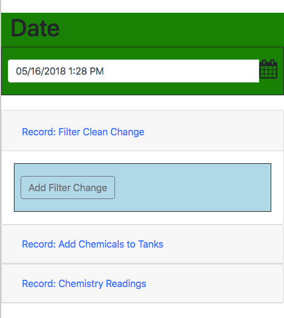
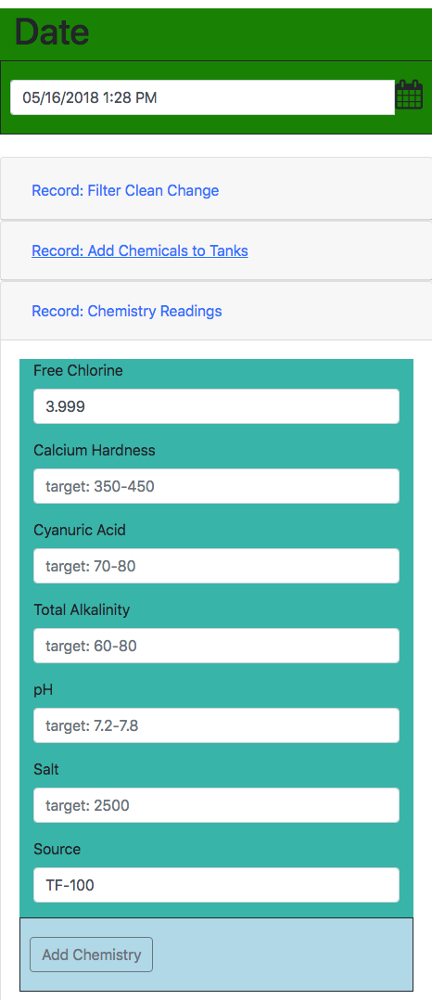
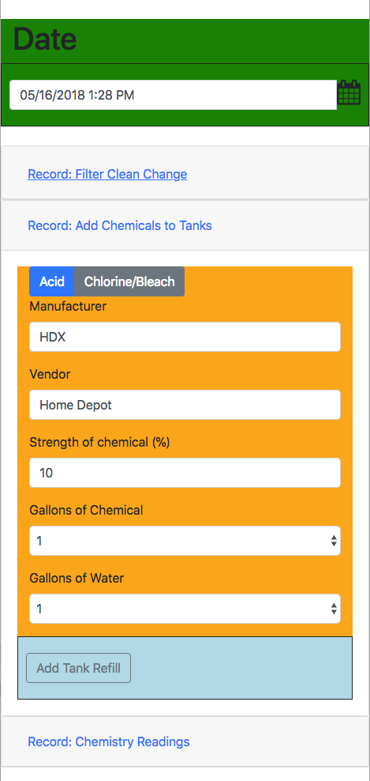

# poolcontroller-manager - Version 1.0.0

# Overview

This project was born out of the need and desire to have a more balanced (read: less algae) pool.  It has been on my radar for a long time, but after chatting with @rjsears and @johnny2678 (see credits below) decided to take the plunge.

# What does this do?

This code has the main goal of interfacing with everything in my pool that Intellitouch (and the accompanying project, [nodejs-poolController](https://github.com/tagyoureit/nodejs-poolcontroller) doesn't control.  There are:

* Read ph/ORP with Atlas Scientific Probes
* Dose chemicals from two pumps containing acid and bleach
* Read the filter PSI through a pressure transducer
* Record all measurements in an Influx Database
* Enables input of chemistry readings from the TF-100 or similiar pool test kits
* Calculate CSI

## What does this not cover
There are a few things that @rjsears controls that are not included here:

* Controls to fill the pool, including e-Tape and an interface to his sprinkler system.  My pool has a mechanical float valve so I'm covered.
* Water temperature sensor.  My Intellitouch takes care of this.

# Pictures
Let's get to the fun stuff!





# Dependencies

* [nodejs-poolController](https://github.com/tagyoureit/nodejs-poolcontroller)
* Physical components (see Equipment Used, below)
* InfluxDB

# Components of Project (Code)
There are two components to this project.
1. A Python App that talks directly to the physical components
2. A Nodejs App that provides a front-end to update the filter changes, tank refills, and manual pool chemical readings.


# Installation
There are probably a lot of customizations you need to do at this point.

## Nodejs webapp
Update the following to match your environment in src/bin/influx-connector.js:

```
var conn = {
    host: '11.11.11.240',
    port: 32769,
    database: 'pool'
}
```

## Python app
You'll need to edit quite a bit.  At a minimum, insert your own Influx server, Twilio, and

# Logic/Approach

There is a Python app that interfaces with a Raspberry Pi through relays, Analog/Digital Signal converters, level shifters, and other sensors.  When certain conditions are met, the app takes action:

* When ph is too high, it turns on the acid pump.  If ph is too low, an alert is sent.
* When ORP is too low, it turns on the chlorine/bleach pump.  If ORP is too high, an alert is sent.
* If the chemicals inside the acid/bleach tank run low, the app sends an alert
* If the filter pressure rises 10psi, an alert is sent.

## Next level of detail
The steps above are at the 10,000 foot level.  Let's dive deeper.

### Reading ph/ORP
ph/ORP values are read every minute and stored in a database.  If any values are way out of spec, an alert is sent.

### Dosing Acid
It is unclear how long it will take the acid to have an impact on the overall ph.  The thought is that the ph level should be between 7.2 and 7.8.  My threshold is starting between 7.4 and 7.6.  The current value is read as the average of the last 5 values in the last 10 minutes.  If the ph climbs to 7.6 I dose acid for 10 seconds and then wait 50 seconds.

My pump is a Stenner Pump pushing 3GPD (3 gallons per day).  In theory, this will give me a maximum of 0.5GPD but I should need much less than that.  Will adjust logic as I learn more about the pool and how it responds.

### Dosing Chlorine or Bleach
ORP is the oxidation reduction potential of chlorine.  It isn't easy to know the exact amount of free chlorine from the ORP, but we can estimate based on relative values.  I'm starting with a relatively narrow window of 640-670.  The current value is read as the average of the last 5 values in the last 5 minutes.  If the ORP drops below 640, the chlorine/bleach pump will turn on at the same rate as the acid pump (10s on; 50s off).

One condition is that I will not run the chlorine pump unless the water temperature is below 65 degrees.  That is the temperature at which the salt water generator can't produce chlorine effectively.

### Switching between acid and bleach
Mixing acid and bleach creates mustard gas.  While I don't think this would be a risk even if I ran both pumps simultaneously, I decided to err on the side of caution.

Only one pump will run at a time and it will continue to cycle on/off until it is within spec.  Once it is in spec, there is a 3 minutes delay and then the next pump will do the same thing.

### Reading Filter PSI
The filter PSI is read through a pressure transducer sitting atop the filter.  It takes the pressure and outputs a voltage (0.5v - 5v) for values from 0-100psi.  This voltage is sent through an ADC (analog to digital converter) and converted back to a PSI.

Each time the reading is taken, it is compared to the earliest PSI at 2300RPM (one of my pump speeds on a schedule) and if the variance is 10+psi, an alert is sent.

When the filter is changed, a button in the web app will increment the count of filter changes and set a new baseline.

### Influx Database
All readings that are taken are stored in InfluxDB (a time series database) and then graphed in Graphana (a complementary time visualization tool).

### CSI
CSI is a formula that measures the balance of chemicals in the pool.  It is similar to the LSI that most Salt Water Generators (SWG's) use, but is more accurate.  Read more from [chem geek](https://www.troublefreepool.com/threads/19688-CSI-formula?p=166165&viewfull=1#post166165) on TFP.com.


### Alerts
All alerts are configured with a time delay.  Some items need more immediate attention (like the ph is way out of spec) and can be alerted every 12 minutes vs other items like the filter change alert which should only be alerted every few days.

# Equipment used

* Raspberry Pi
* [Dual Channel Relay](https://www.amazon.com/gp/product/B072BY3KJF/ref=oh_aui_detailpage_o05_s00?ie=UTF8&psc=1)
* [ADS1115 Analog Digital Converter](https://www.amazon.com/gp/product/B01DLHKMO2/ref=oh_aui_search_detailpage?ie=UTF8&psc=1)
* [5v-3.3v Logic Level Converter](https://www.amazon.com/gp/product/B0148BLZGE/ref=oh_aui_detailpage_o02_s00?ie=UTF8&psc=1)
* 2x [DFRobot Liquid Level Sensor](https://www.dfrobot.com/product-1493.html)
* [Pressure Inducer](https://www.ebay.com/itm/Pressure-transducer-or-sender-100-psi-5V-for-oil-fuel-air-water/261260635816?ssPageName=STRK%3AMEBIDX%3AIT&_trksid=p2057872.m2749.l2649)
* 2x [Stenner 15 Gallon Tank](https://cannonwater.com/stenner-15-gallon-uv-resistant-gray-tank-for-45-85-series-pumps/) + [Stenner 3GPD Fixed Rate Peristaltic Pump](https://cannonwater.com/stenner-45-85-adjustable-high-pressure-pump-45mhp-or-85mhp/)
* Atlas Scientific [pH](https://www.atlas-scientific.com/product_pages/kits/ph-kit.html) and [ORP](https://www.atlas-scientific.com/product_pages/kits/orp_kit.html) Probes
* [WhiteHat Tentacle T3 Shield](https://www.atlas-scientific.com/product_pages/components/tentacle-t3.html)
* [Hana Wireless Enclosure](https://www.hanawireless.com/product-page/14x12x7-inch-weatherproof-nema-4x-enclosure-with-mounting-plate-cooling-fan-so)
* Various other components like screws, cable extenders, wood, electrical line, etc etc


# Influx Schema
This app reads/writes to the InfluxDB and uses the following measurements:

alerts
chemistry
filter
tank_level
tank_pump

## alerts
This table holds any alerts that are sent, phone numbers and the body of the text.

name: alerts
fieldKey fieldType
-------- ---------
sid      string
status   float

name: alerts
tagKey
------
alert
body
from
source
to
type

## chemistry

name: chemistry
fieldKey fieldType
-------- ---------
value    float

name: chemistry
tagKey
------
source
type

## filter

name: filter
fieldKey              fieldType
--------              ---------
current_filter_change float

name: filter
tagKey
------
source
type

## tank_level

name: tank_level
fieldKey fieldType
-------- ---------
status   float

name: tank_level
tagKey
------
description
source
type

## tank_pump

name: tank_pump
fieldKey fieldType
-------- ---------
status   float

name: tank_pump
tagKey
------
from_str
pump
source
to_str
type

## Futures
* Ensure my logic is accurate for the pumps
* Add logic to supplement the SWG with the chlorine tank if the numbers are out of spec
* Use machine learning to automatically adjust the dosing based on upcoming weather forecast, estimated number of swimmers, if the pool cover is on/off, etc.
* Better configuration of alerts and delays between alerts.

# Credit

1.  Richard Sears at [Hackster.io](https://www.hackster.io/user3424878278/pool-fill-control-119ab7) and [Github/@rjsears](https://github.com/rjsears/Pool_Fill_Control/).  He has been an inspiration and my Python modules are modeled after his.
2.  [@johnny2678](https://github.com/johnny2678) who has been there (in the chat rooms) with me planning and leaning
3.  [TroubleFreePool.com](https://www.troublefreepool.com/) and their [Pool Calculator](https://www.troublefreepool.com/calc.html) are some of the absolute best resources on the internet for pool knowledge.
